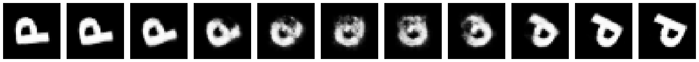
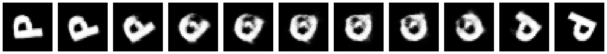
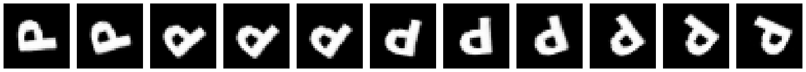
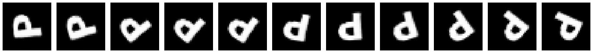
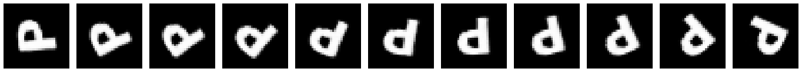
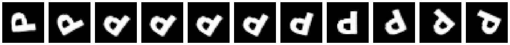
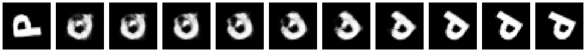

# Score-Based Riemannian Metrics 
GitHub Repository for my Master Thesis on Score-Based Riemannian Metrics from Diffusion Models

## Overview 
This repository contains the code necessary to reproduce the experiments from my thesis. Specifically, I investigated the behavior of different Riemannian metrics from literature, as well as proposed a new metric that interpolates between manifold-aware and density-aware terms. The manifold-aware term is composed of the Jacobian of the score function, where as the density-aware term is the magnitude of the score function. The Jacobian term guides geodesics to move tangentially to the underlying data manifold, where as the magnitude term ideally pulls the geodesic towards higher density regions.

## Repository Structure 
```
├── assets 
├── diffusion_model_dependencies/   # scripts and modules to train, evaluate, and sample from score-based diffusion models
├── experiments_toy_datasets/       # geodesics under different metrics for the toy datasets (circle, s-curve, swiss-roll/spiral, ucg, wcg, two moons)
├── experiments_urc/                # geodesics on the uniform rotated characters (URC) dataset
├── experiments_morphbench/         # geodesics in the stable diffusion latent space
├── tutorial.ipynb                  # notebook to optimize geodesics under different Riemannian metrics on the toy datasets
├── requirements.txt
└── README.md
```
## Example Geodesics

### URC (Uniform Rotated Characters)

<table>
  <tr>
    <td align="right" width="120"><b>LERP</b></td>
    <td></td>
  </tr>
  <tr>
    <td align="right"><b>SLERP</b></td>
    <td></td>
  </tr>
  <tr>
    <td align="right"><b>λ = 0</b></td>
    <td></td>
  </tr>
  <tr>
    <td align="right"><b>λ = 0.1</b></td>
    <td></td>
  </tr>
  <tr>
    <td align="right"><b>λ = 1</b></td>
    <td></td>
  </tr>
  <tr>
    <td align="right"><b>LAND</b></td>
    <td></td>
  </tr>
  <tr>
    <td align="right"><b>RBF</b></td>
    <td></td>
  </tr>
</table>

### MorphBench (M) in Stable Diffusion v2.1-base 

<table>
  <tr>
    <td align="right" width="120"><b>LERP</b></td>
    <td></td>
  </tr>
  <tr>
    <td align="right"><b>SLERP</b></td>
    <td></td>
  </tr>
  <tr>
    <td align="right"><b>λ = 0</b></td>
    <td></td>
  </tr>
  <tr>
    <td align="right"><b>λ = 0.1</b></td>
    <td></td>
  </tr>
  <tr>
    <td align="right"><b>λ = 0.25</b></td>
    <td></td>
  </tr>
  <tr>
    <td align="right"><b>λ = 0.5</b></td>
    <td></td>
  </tr>
  <tr>
    <td align="right"><b>λ = 0.75</b></td>
    <td></td>
  </tr>
  <tr>
    <td align="right"><b>λ = 1</b></td>
    <td></td>
  </tr>
</table>


